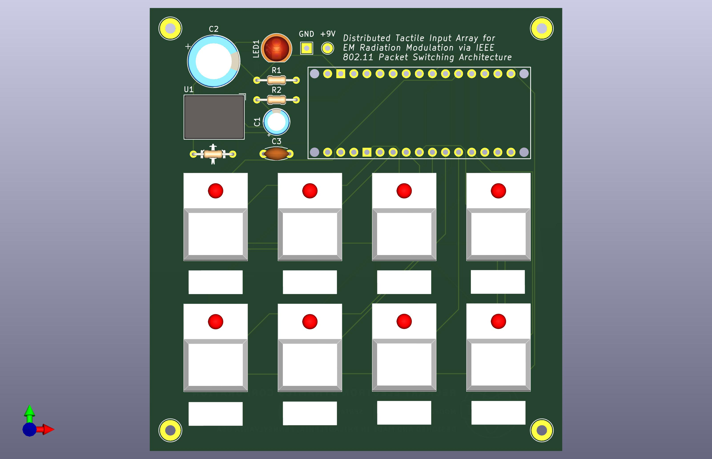

# PATCOM - Packet Commander

8-button WiFi controller for IoT projects, smart home control, and network automation.



## Overview

PATCOM provides 8 buttons with WiFi connectivity. Press a button to send network packets - HTTP, MQTT, UDP, or custom protocols. Each button has an LED for visual feedback.

### Specs
- **MCU**: Arduino Nano ESP32
- **Inputs**: 8× illuminated buttons (PB86)
- **Power**: 9V battery → 3.3V regulator
- **Network**: 2.4GHz WiFi
- **Current**: 160-240mA

## Quick Start

### 1. Install Arduino IDE
- Download [Arduino IDE 2.0+](https://www.arduino.cc/en/software)
- Add ESP32 board URL in Preferences:
  ```
  https://espressif.github.io/arduino-esp32/package_esp32_index.json
  ```
- Install "Arduino ESP32 Boards" via Board Manager
- Install ArduinoJson library

### 2. Configure Firmware
Open `firmware/outlets.cpp` and set your WiFi:
```cpp
const char* WIFI_SSID = "YourNetwork";
const char* WIFI_PASS = "YourPassword";
```

### 3. Upload
- Connect Arduino via USB-C
- Select: **Tools → Board → Arduino Nano ESP32**
- Select your port
- Click Upload (hold BOOT if needed)

## Pin Connections

| Function | Pin | | Function | Pin |
|----------|-----|-|----------|-----|
| Button 0-7 | D2-D9 | | LED 0-7 | A0-A7 |
| Battery Monitor | D12 | | Status LED | D13 |
| Power In | 3V3 | | Ground | GND |

## Basic Usage

### Button Handler
```cpp
void handleButtonPress(int button) {
  // Toggle LED
  ledState[button] = !ledState[button];
  digitalWrite(ledPins[button], ledState[button]);
  
  // Send your packet
  HTTPClient http;
  http.begin("http://server.com/api");
  http.POST("{\"button\":" + String(button) + "}");
  http.end();
}
```

### Serial Commands (115200 baud)
- `STATUS` - Show states
- `TOGGLE n` - Toggle LED n
- `BATTERY` - Check voltage
- `HELP` - List commands

## Circuit Assembly

### Parts List
- Arduino Nano ESP32
- 8× PB86 switches
- RECOM R-78E3.3-1.0 regulator
- Capacitors: 100µF, 470µF, 10µF
- Resistors: 100kΩ, 33kΩ, 1kΩ
- 9V battery connector
- Terminal blocks

### Wiring
1. Battery → Regulator → Arduino 3V3 pin
2. Each button: terminal → Arduino pin, LED+ → analog pin
3. All grounds connected together
4. Battery monitor: voltage divider to D12

## Example Applications

**Smart Home**
```cpp
http.POST("/api/lights/toggle");
```

**MQTT Control**
```cpp
mqtt.publish("home/button/0", "pressed");
```

**UDP Packets**
```cpp
udp.beginPacket("192.168.1.100", 8888);
udp.print("BTN:" + String(button));
udp.endPacket();
```

## Troubleshooting

| Issue | Fix |
|-------|-----|
| Upload fails | Hold BOOT button |
| No WiFi | Check 2.4GHz network |
| Short battery | Normal: 2-4 hours |
| LEDs dim | Low battery |

## License

MIT License - Open source hardware and software.

## Repository

```
patcom/
├── hardware/
│   ├── patcom.kicad_pcb
│   ├── patcom.kicad_prl
│   ├── patcom.kicad_pro
│   └── patcom.kicad_sch
├── firmware/
│   └── outlets.cpp
└── README.md
```

---

For help: Open a GitHub issue