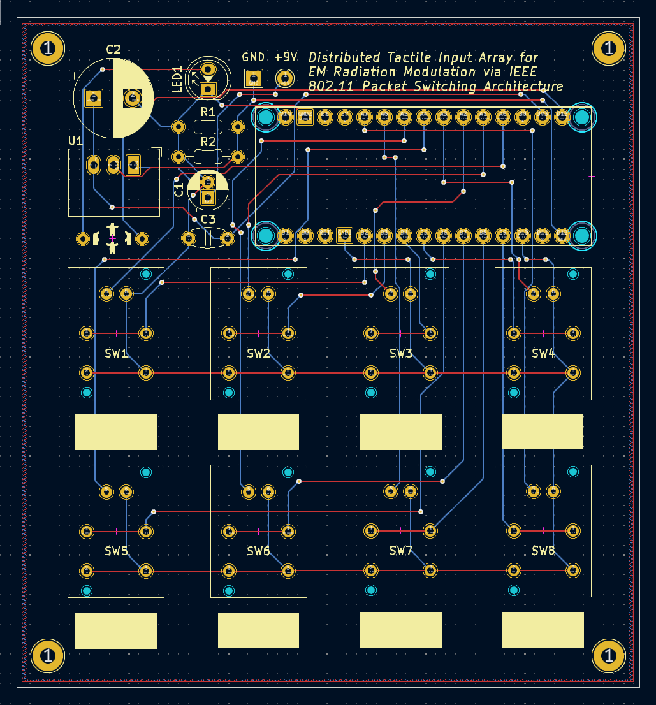

# Packet Commander
8-button WiFi controller with advanced configuration management, power optimization, and multi-protocol capabilities through its desktop application.



## Overview

Packet Commander is a versatile IoT controller featuring 8 programmable buttons with LED feedback, comprehensive WiFi connectivity, and intelligent power management. Designed for smart home automation, network testing, and custom IoT applications.

### Key Features
- **8 Programmable Buttons**: Directly supports HTTP and Webhook actions. The desktop application allows configuration for MIDI, OSC, Serial, and custom scripts, which are then transmitted via HTTP or as data for custom firmware handling.
- **Smart Power Management**: Includes battery monitoring and optimized CPU frequency for power efficiency.
- **Desktop App**: Full-featured Electron configurator with device management.
- **Persistent Storage**: Configuration saved to flash memory on the device.
- **Multi-Protocol Support**: Firmware directly supports HTTP/HTTPS and Webhook.
- **Network Discovery**: Automatic device detection and configuration synchronization via the desktop application.

### Hardware Specs
- **MCU**: Arduino Nano ESP32 (Dual-core, 240MHz).
- **Inputs**: 8× illuminated tactile buttons (PB86).
- **Power**: 9V battery → 3.3V regulated (6-8 hour runtime).
- **Network**: 2.4GHz WiFi 802.11b/g/n.
- **Current**: 80-240mA.
- **Storage**: 4MB Flash, EEPROM for configuration.
- **Battery Monitor**: Real-time voltage sensing with low-battery alerts.

## Quick Start

### 1. Hardware Setup
- Flash the firmware to your Arduino Nano ESP32.
- Connect 9V battery to power input.
- Power LED will indicate system status.

### 2. First Boot Configuration
1. Power on device - it will create "PATCOM-Config" WiFi hotspot.
2. Connect to hotspot (password: `patcom123`).
3. Open browser to `192.168.4.1`.
4. Configure your WiFi network and device settings.
5. Device will restart and connect to your network.

### 3. Desktop Configuration App
```bash
# Install dependencies
npm install

# Build all TypeScript
npm run build

# Run in development mode
npm run dev

# Run in production mode
npm start

# Build for distribution
npm run dist
```

### 4. Device Discovery & Configuration
- Click "Discover Devices" to find controllers on your network
- Configure button actions: HTTP requests, MIDI, OSC, webhooks, custom scripts
- Upload configuration to device
- Test buttons and monitor activity

## Firmware Installation

### Arduino IDE Setup
- Download [Arduino IDE 2.0+](https://www.arduino.cc/en/software)
- Add ESP32 board URL in Preferences:
  ```
  https://espressif.github.io/arduino-esp32/package_esp32_index.json
  ```
- Install "Arduino ESP32 Boards" via Board Manager
- Install required libraries: ArduinoJson, AsyncUDP, ESPmDNS

### Firmware Upload
- Connect Arduino via USB-C
- Select: **Tools → Board → Arduino Nano ESP32**
- Select your port
- Open `firmware/patcom.cpp`
- Click Upload

## Configuration Management

### Button Action Types
- **HTTP/HTTPS**: Send GET/POST/PUT requests with custom headers and body
- **Webhook**: Secure webhook calls with device context and secrets
- **None**: Disable button (LED-only feedback)

### Device Settings
- **Network**: WiFi credentials, static IP configuration
- **Discovery**: Device name, auto-discovery, config sync settings
- **API Keys**: Secure storage for service credentials

### Configuration Storage
- Settings persisted to ESP32 flash memory
- Automatic backup during low battery
- Configuration hash verification
- Remote sync with desktop app

## Serial Commands (115200 baud)
- `STATUS` - Device information and battery status
- `CONFIG` - Display current configuration as JSON
- `SET_CONFIG:<json>` - Upload new configuration
- `TEST:<n>` - Test button n (0-7)
- `WIFI` - WiFi connection status
- `BATTERY` - Current battery voltage
- `HELP` - List all available commands

## Pin Connections

| Function | Pin | | Function | Pin |
|----------|-----|-|----------|-----|
| Button 0-7 | D2-D9 | | LED 0-7 | A0-A7 |
| Battery Monitor | A8 | | Status LED | D13 |
| Power In | 3V3 | | Ground | GND |
| USB Serial | USB-C | | Programming | BOOT + RESET |

## Circuit Assembly

### Parts List
- Packet Commander PCB
- Arduino Nano ESP32
- 8× PB86 switches
- RECOM R-78E3.3-1.0 regulator
- Capacitors: 100µF, 470µF, 10µF
- Resistors: 100kΩ, 33kΩ, 1kΩ
- 9V battery connector
- Terminal blocks

### Wiring
1. Battery → Regulator → Arduino 3V3 pin
2. Each button: terminal → Arduino pin, LED+ → analog pin
3. All grounds connected together
4. Battery monitor: voltage divider to D12

## Example Use Cases

### Smart Home Control
```json
{
  "action": "http",
  "config": {
    "url": "http://homeassistant.local:8123/api/services/light/toggle",
    "method": "POST",
    "headers": {"Authorization": "Bearer YOUR_TOKEN"},
    "body": "{\"entity_id\": \"light.living_room\"}"
  }
}
```

### Custom Webhook
```json
{
  "action": "webhook",
  "config": {
    "url": "https://api.example.com/webhook",
    "secret": "your-webhook-secret"
  }
}
```

## Troubleshooting

| Issue | Solution |
|-------|----------|
| Upload fails | Hold RESET button during upload. Short GPIO0 to GND to reset the boot state. |
| No WiFi connection | Check 2.4GHz network, verify credentials |
| Short battery life | Normal: 6-8 hours, enable power saving |
| Device not discovered | Check firewall, ensure same network |
| LEDs dim/flickering | Low battery or loose connections |
| Configuration not saving | Check flash memory, try factory reset |
| Serial connection issues | Use 115200 baud, check USB cable |

## License

MIT License - Open source hardware and software.

## Contributing

Packet Commander is open source hardware and software. Contributions welcome!

1. Fork the repository
2. Create a feature branch
3. Submit a pull request with detailed description
